# IntelliJ IDEA Git Flow Capture Report

Generated: 2026-03-22T21:58:52.355024Z

---

## Summary

| Metric | Value |
|--------|-------|
| Total events captured | 23 |
| Event types | CHERRY_PICK, PUSH, BRANCH_CREATE, COMMIT, MERGE, FETCH, PULL, CHECKOUT, REBASE, RESET, STASH |
| Success rate | 82% (19/23) |
| Time range | 2026-03-22T21:52:59.894540Z to 2026-03-22T21:57:57.293670Z |

## Events by Type

### CHERRY_PICK (2 events)

| # | Timestamp | Source | Branch | Outcome | Git Equivalent |
|---|-----------|--------|--------|---------|----------------|
| 1 | 2026-03-22T21:52:59.894540Z | UI_ACTION |  | SUCCESS | `git cherry-pick ` |
| 2 | 2026-03-22T21:53:13.511477Z | UI_ACTION |  | SUCCESS | `git cherry-pick ` |

### PUSH (4 events)

| # | Timestamp | Source | Branch | Outcome | Git Equivalent |
|---|-----------|--------|--------|---------|----------------|
| 1 | 2026-03-22T21:53:35.752154Z | KEYBOARD_SHORTCUT |  | SUCCESS | `git push origin ` |
| 2 | 2026-03-22T21:55:00.008953Z | KEYBOARD_SHORTCUT | feature/gitflow-capture-test-1774216440530 | FAILURE | `git push origin feature/gitflow-capture-test-1774216440530` |
| 3 | 2026-03-22T21:55:16.392434Z | MENU |  | CANCELLED | `git push origin ` |
| 4 | 2026-03-22T21:56:43.028400Z | KEYBOARD_SHORTCUT | feature/rebase-test-1774216557667 | SUCCESS | `git push origin feature/rebase-test-1774216557667` |

### BRANCH_CREATE (1 events)

| # | Timestamp | Source | Branch | Outcome | Git Equivalent |
|---|-----------|--------|--------|---------|----------------|
| 1 | 2026-03-22T21:54:13.758771Z | UI_ACTION | feature/gitflow-capture-test-1774216440530 | SUCCESS | `git checkout -b feature/gitflow-capture-test-1774216440530` |

### COMMIT (2 events)

| # | Timestamp | Source | Branch | Outcome | Git Equivalent |
|---|-----------|--------|--------|---------|----------------|
| 1 | 2026-03-22T21:54:21.879328Z | UI_ACTION | feature/gitflow-capture-test-1774216440530 | SUCCESS | `git add . && git commit -m "<message>"` |
| 2 | 2026-03-22T21:54:40.273772Z | KEYBOARD_SHORTCUT | feature/gitflow-capture-test-1774216440530 | SUCCESS | `git add . && git commit -m "<message>"` |

### MERGE (3 events)

| # | Timestamp | Source | Branch | Outcome | Git Equivalent |
|---|-----------|--------|--------|---------|----------------|
| 1 | 2026-03-22T21:55:07.477284Z | UI_ACTION |  | SUCCESS | `git merge <branch>` |
| 2 | 2026-03-22T21:55:23.448787Z | UI_ACTION |  | CANCELLED | `git merge <branch>` |
| 3 | 2026-03-22T21:55:56.319897Z | UI_ACTION |  | SUCCESS | `git merge <branch>` |

### FETCH (1 events)

| # | Timestamp | Source | Branch | Outcome | Git Equivalent |
|---|-----------|--------|--------|---------|----------------|
| 1 | 2026-03-22T21:55:34.629156Z | MENU |  | SUCCESS | `git fetch --all` |

### PULL (1 events)

| # | Timestamp | Source | Branch | Outcome | Git Equivalent |
|---|-----------|--------|--------|---------|----------------|
| 1 | 2026-03-22T21:55:45.419212Z | MENU |  | SUCCESS | `git pull origin ` |

### CHECKOUT (2 events)

| # | Timestamp | Source | Branch | Outcome | Git Equivalent |
|---|-----------|--------|--------|---------|----------------|
| 1 | 2026-03-22T21:56:11.915063Z | UI_ACTION | feature/rebase-test-1774216557667 | SUCCESS | `git checkout feature/rebase-test-1774216557667` |
| 2 | 2026-03-22T21:57:43.357175Z | UI_ACTION | main | SUCCESS | `git checkout main` |

### REBASE (1 events)

| # | Timestamp | Source | Branch | Outcome | Git Equivalent |
|---|-----------|--------|--------|---------|----------------|
| 1 | 2026-03-22T21:56:22.965588Z | MENU | feature/rebase-test-1774216557667 | SUCCESS | `git rebase main` |

### RESET (4 events)

| # | Timestamp | Source | Branch | Outcome | Git Equivalent |
|---|-----------|--------|--------|---------|----------------|
| 1 | 2026-03-22T21:56:51.584371Z | UI_ACTION |  | SUCCESS | `git reset --mixed HEAD~1` |
| 2 | 2026-03-22T21:57:02.658538Z | UI_ACTION |  | SUCCESS | `git reset --soft HEAD~1` |
| 3 | 2026-03-22T21:57:12.015204Z | UI_ACTION |  | SUCCESS | `git reset --mixed HEAD~1` |
| 4 | 2026-03-22T21:57:24.028936Z | UI_ACTION |  | SUCCESS | `git reset --hard HEAD~1` |

### STASH (2 events)

| # | Timestamp | Source | Branch | Outcome | Git Equivalent |
|---|-----------|--------|--------|---------|----------------|
| 1 | 2026-03-22T21:57:29.231246Z | MENU |  | FAILURE | `git stash push -m "<message>"` |
| 2 | 2026-03-22T21:57:57.293670Z | MENU |  | SUCCESS | `git stash push -m "<message>"` |

## Detailed Event Log

### Event 1: CHERRY_PICK

- **ID:** `e84bdccc-d8e9-4b09-a265-16c935f54af0`
- **Timestamp:** 2026-03-22T21:52:59.894540Z
- **Source:** UI_ACTION
- **UI Path:** open_git_log_for_cherry_pick
- **Branch:** 
- **Outcome:** SUCCESS
- **Git Equivalent:** `git cherry-pick `
- **Screenshot:** 

### Event 2: CHERRY_PICK

- **ID:** `5ebe3086-cb40-4db8-b9a0-9ea935c248f1`
- **Timestamp:** 2026-03-22T21:53:13.511477Z
- **Source:** UI_ACTION
- **UI Path:** cherry_pick_commit
- **Branch:** 
- **Outcome:** SUCCESS
- **Git Equivalent:** `git cherry-pick `
- **Screenshot:** 

### Event 3: PUSH

- **ID:** `28cf7089-e6c5-4205-8f12-3632dab26025`
- **Timestamp:** 2026-03-22T21:53:35.752154Z
- **Source:** KEYBOARD_SHORTCUT
- **UI Path:** push_after_cherry_pick
- **Branch:** 
- **Outcome:** SUCCESS
- **Git Equivalent:** `git push origin `
- **Screenshot:** 

### Event 4: BRANCH_CREATE

- **ID:** `89b50749-1920-4794-8b90-226132fabf4b`
- **Timestamp:** 2026-03-22T21:54:13.758771Z
- **Source:** UI_ACTION
- **UI Path:** create_feature_branch
- **Branch:** feature/gitflow-capture-test-1774216440530
- **Outcome:** SUCCESS
- **Git Equivalent:** `git checkout -b feature/gitflow-capture-test-1774216440530`
- **Screenshot:** 

### Event 5: COMMIT

- **ID:** `91451c9f-6bc1-4964-ad7c-284e1ebe030a`
- **Timestamp:** 2026-03-22T21:54:21.879328Z
- **Source:** UI_ACTION
- **UI Path:** open_commit_tool_window
- **Branch:** feature/gitflow-capture-test-1774216440530
- **Outcome:** SUCCESS
- **Git Equivalent:** `git add . && git commit -m "<message>"`
- **Screenshot:** 

### Event 6: COMMIT

- **ID:** `259b9708-a4f6-4ef8-ab19-62581775b29d`
- **Timestamp:** 2026-03-22T21:54:40.273772Z
- **Source:** KEYBOARD_SHORTCUT
- **UI Path:** stage_and_commit
- **Branch:** feature/gitflow-capture-test-1774216440530
- **Outcome:** SUCCESS
- **Git Equivalent:** `git add . && git commit -m "<message>"`
- **Screenshot:** 

### Event 7: PUSH

- **ID:** `348bee1a-b919-4e80-bf97-c4a2b355586d`
- **Timestamp:** 2026-03-22T21:55:00.008953Z
- **Source:** KEYBOARD_SHORTCUT
- **UI Path:** push_to_remote
- **Branch:** feature/gitflow-capture-test-1774216440530
- **Outcome:** FAILURE
- **Git Equivalent:** `git push origin feature/gitflow-capture-test-1774216440530`
- **Screenshot:** 

### Event 8: MERGE

- **ID:** `d024dbe4-b2a3-4c13-8969-f9f989d76580`
- **Timestamp:** 2026-03-22T21:55:07.477284Z
- **Source:** UI_ACTION
- **UI Path:** open_pr_tool_window
- **Branch:** 
- **Outcome:** SUCCESS
- **Git Equivalent:** `git merge <branch>`
- **Screenshot:** 

### Event 9: PUSH

- **ID:** `543fc77b-a58a-44ab-a014-dc37fbb5361f`
- **Timestamp:** 2026-03-22T21:55:16.392434Z
- **Source:** MENU
- **UI Path:** create_pull_request
- **Branch:** 
- **Outcome:** CANCELLED
- **Git Equivalent:** `git push origin `
- **Screenshot:** 

### Event 10: MERGE

- **ID:** `747b28f5-78ad-4f36-be7e-ca252e59cc35`
- **Timestamp:** 2026-03-22T21:55:23.448787Z
- **Source:** UI_ACTION
- **UI Path:** review_and_merge_pr
- **Branch:** 
- **Outcome:** CANCELLED
- **Git Equivalent:** `git merge <branch>`
- **Screenshot:** 

### Event 11: FETCH

- **ID:** `8d34708c-9046-49a2-9920-f324bae1e81e`
- **Timestamp:** 2026-03-22T21:55:34.629156Z
- **Source:** MENU
- **UI Path:** fetch_from_remote
- **Branch:** 
- **Outcome:** SUCCESS
- **Git Equivalent:** `git fetch --all`
- **Screenshot:** 

### Event 12: PULL

- **ID:** `94f2d3a3-02ab-4ecb-9587-1552a71fae2c`
- **Timestamp:** 2026-03-22T21:55:45.419212Z
- **Source:** MENU
- **UI Path:** pull_with_merge
- **Branch:** 
- **Outcome:** SUCCESS
- **Git Equivalent:** `git pull origin `
- **Screenshot:** 

### Event 13: MERGE

- **ID:** `fea4e25c-4a55-4493-b20e-6b4f655eec58`
- **Timestamp:** 2026-03-22T21:55:56.319897Z
- **Source:** UI_ACTION
- **UI Path:** handle_merge_conflicts
- **Branch:** 
- **Outcome:** SUCCESS
- **Git Equivalent:** `git merge <branch>`
- **Screenshot:** 

### Event 14: CHECKOUT

- **ID:** `77dd26d0-130c-4847-a97e-8532719a5614`
- **Timestamp:** 2026-03-22T21:56:11.915063Z
- **Source:** UI_ACTION
- **UI Path:** checkout_feature_for_rebase
- **Branch:** feature/rebase-test-1774216557667
- **Outcome:** SUCCESS
- **Git Equivalent:** `git checkout feature/rebase-test-1774216557667`
- **Screenshot:** 

### Event 15: REBASE

- **ID:** `1b77e51f-8274-4637-a853-9b68ad9ad0c5`
- **Timestamp:** 2026-03-22T21:56:22.965588Z
- **Source:** MENU
- **UI Path:** rebase_onto_main
- **Branch:** feature/rebase-test-1774216557667
- **Outcome:** SUCCESS
- **Git Equivalent:** `git rebase main`
- **Screenshot:** 

### Event 16: PUSH

- **ID:** `ef8de050-12cc-4ac2-bbe3-2c01270fc8db`
- **Timestamp:** 2026-03-22T21:56:43.028400Z
- **Source:** KEYBOARD_SHORTCUT
- **UI Path:** force_push_after_rebase
- **Branch:** feature/rebase-test-1774216557667
- **Outcome:** SUCCESS
- **Git Equivalent:** `git push origin feature/rebase-test-1774216557667`
- **Screenshot:** 

### Event 17: RESET

- **ID:** `011cd2c1-87fe-4f19-8920-8cb4d5e8d5ab`
- **Timestamp:** 2026-03-22T21:56:51.584371Z
- **Source:** UI_ACTION
- **UI Path:** open_git_log_for_rollback
- **Branch:** 
- **Outcome:** SUCCESS
- **Git Equivalent:** `git reset --mixed HEAD~1`
- **Screenshot:** 

### Event 18: RESET

- **ID:** `b0c7272b-8599-45a0-b12c-9080e4606ab4`
- **Timestamp:** 2026-03-22T21:57:02.658538Z
- **Source:** UI_ACTION
- **UI Path:** reset_soft
- **Branch:** 
- **Outcome:** SUCCESS
- **Git Equivalent:** `git reset --soft HEAD~1`
- **Screenshot:** 

### Event 19: RESET

- **ID:** `07409f10-dd1c-4c80-8a7e-1b2afc2facc4`
- **Timestamp:** 2026-03-22T21:57:12.015204Z
- **Source:** UI_ACTION
- **UI Path:** reset_mixed
- **Branch:** 
- **Outcome:** SUCCESS
- **Git Equivalent:** `git reset --mixed HEAD~1`
- **Screenshot:** 

### Event 20: RESET

- **ID:** `8b349b32-dd63-47c1-b88f-3c1090e1b435`
- **Timestamp:** 2026-03-22T21:57:24.028936Z
- **Source:** UI_ACTION
- **UI Path:** reset_hard
- **Branch:** 
- **Outcome:** SUCCESS
- **Git Equivalent:** `git reset --hard HEAD~1`
- **Screenshot:** 

### Event 21: STASH

- **ID:** `9ebfeddf-54d0-46a0-b7a7-8c5992d7e06d`
- **Timestamp:** 2026-03-22T21:57:29.231246Z
- **Source:** MENU
- **UI Path:** stash_changes
- **Branch:** 
- **Outcome:** FAILURE
- **Git Equivalent:** `git stash push -m "<message>"`
- **Screenshot:** 

### Event 22: CHECKOUT

- **ID:** `ee0d4968-d486-40fe-807c-a0070432b94d`
- **Timestamp:** 2026-03-22T21:57:43.357175Z
- **Source:** UI_ACTION
- **UI Path:** switch_branch_with_stash
- **Branch:** main
- **Outcome:** SUCCESS
- **Git Equivalent:** `git checkout main`
- **Screenshot:** 

### Event 23: STASH

- **ID:** `41a06c30-e2c3-412f-8a88-b49c132fbdcd`
- **Timestamp:** 2026-03-22T21:57:57.293670Z
- **Source:** MENU
- **UI Path:** pop_stash
- **Branch:** 
- **Outcome:** SUCCESS
- **Git Equivalent:** `git stash push -m "<message>"`
- **Screenshot:** 

## Workflow Sequence Diagram

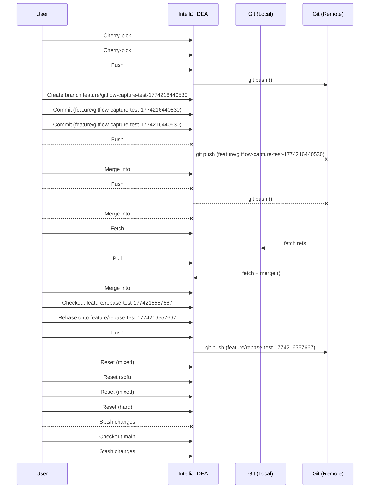

## Captured Screenshots

### 20260323_085253_381_before_open_git_log_for_cherry_pick

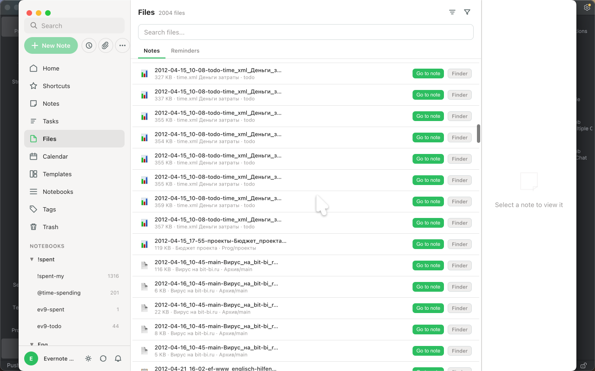

### 20260323_085257_552_during_git_log_commit_list

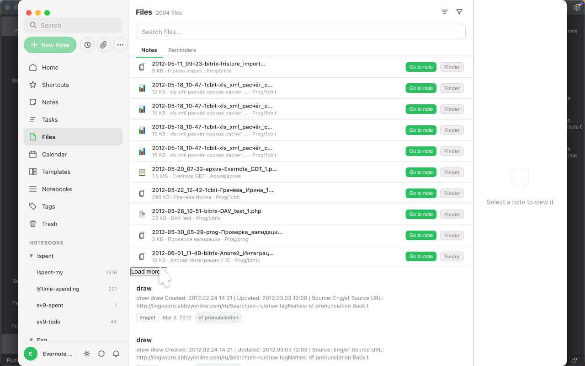

### 20260323_085259_398_after_open_git_log_for_cherry_pick

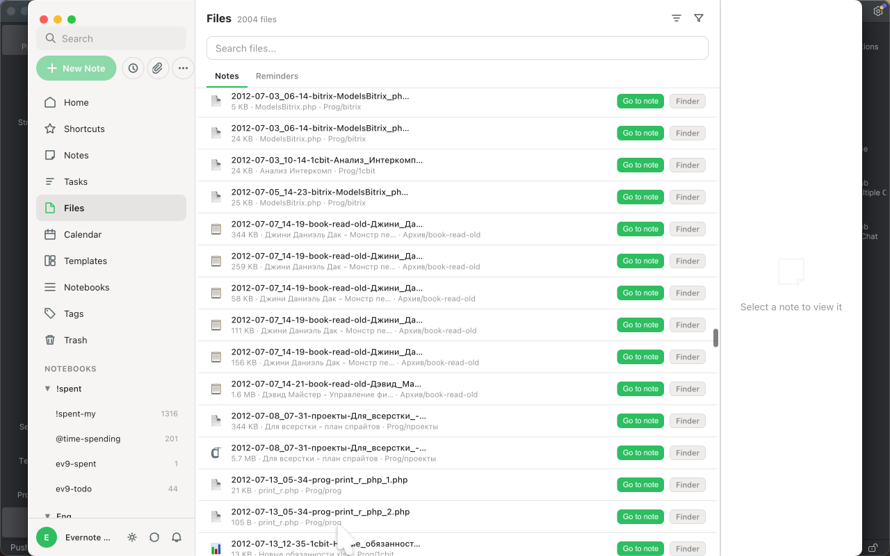

### 20260323_085302_967_before_cherry_pick_commit

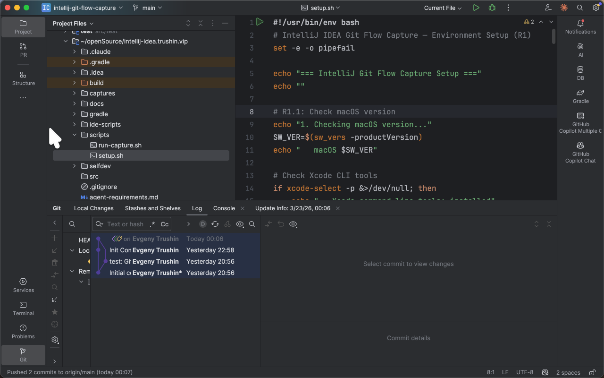

### 20260323_085307_599_during_git_log_before_cherry_pick

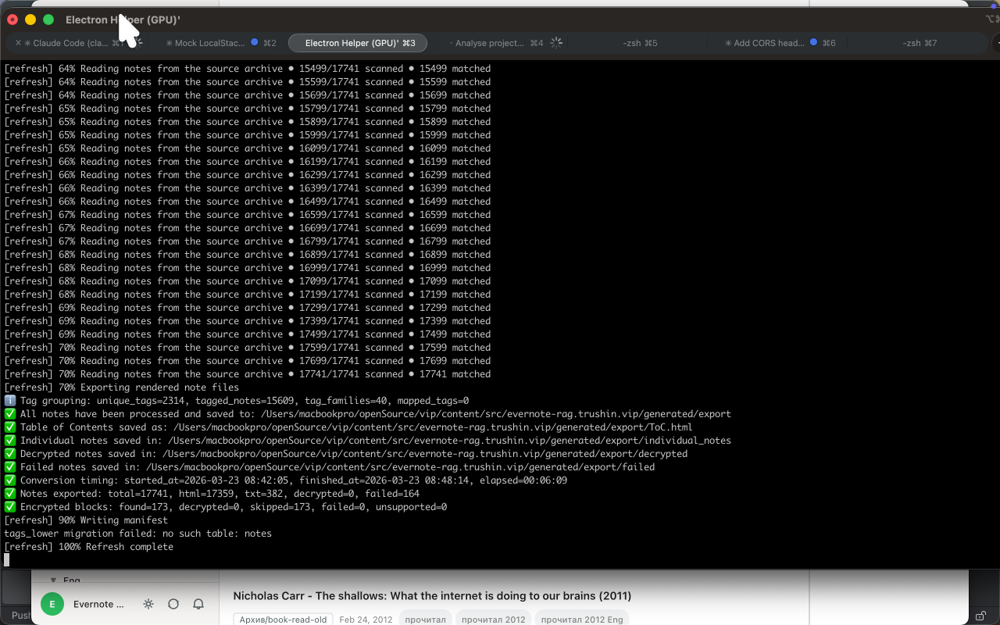

### 20260323_085309_877_during_cherry_pick_action

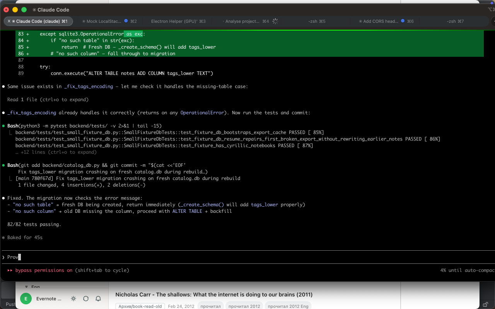

### 20260323_085313_246_after_cherry_pick_commit

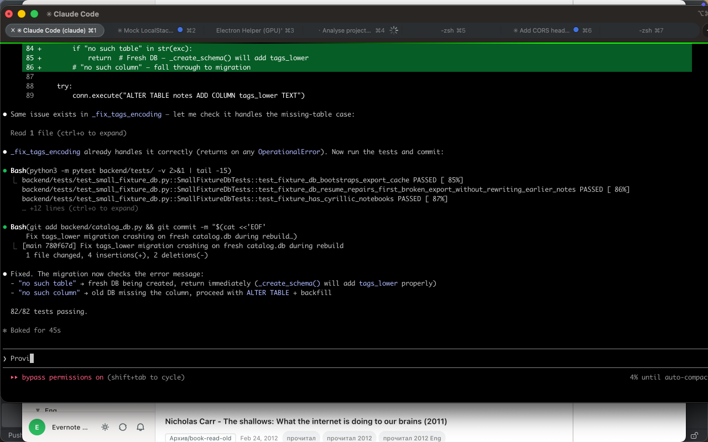

### 20260323_085316_285_before_push_after_cherry_pick

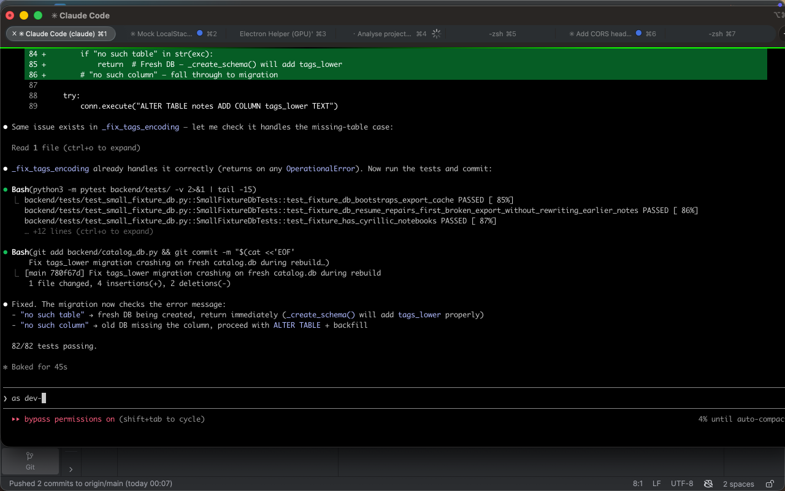

### 20260323_085328_941_during_push_dialog_cherry_pick_error

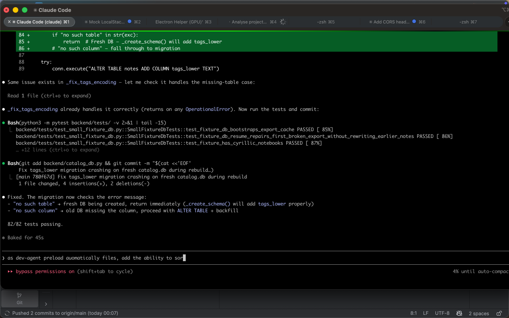

### 20260323_085335_467_after_push_after_cherry_pick

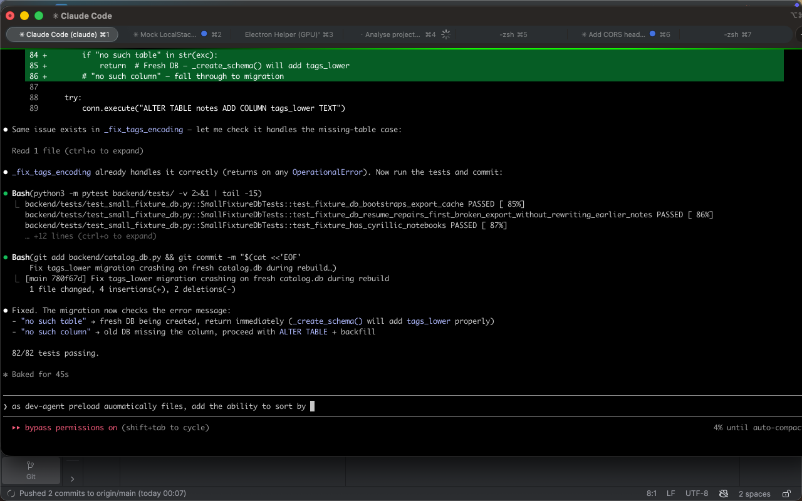

### 20260323_085402_293_before_create_feature_branch

### 20260323_085406_117_during_branches_popup

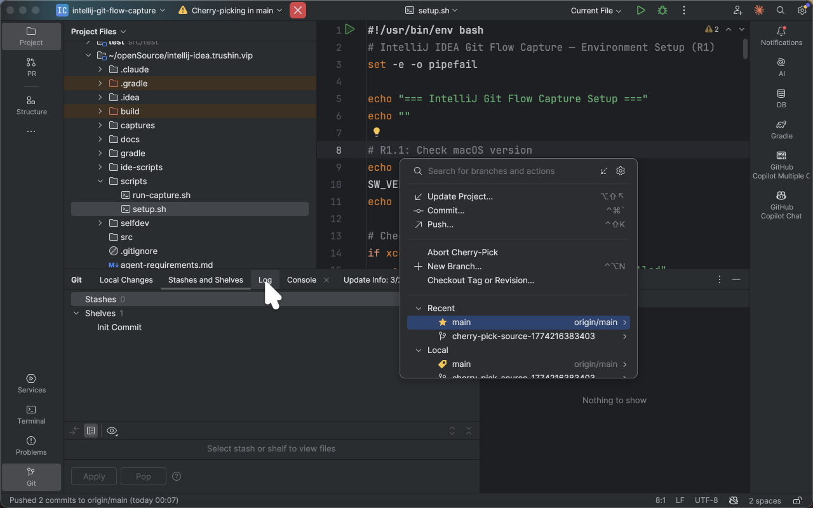

### 20260323_085413_466_after_create_feature_branch

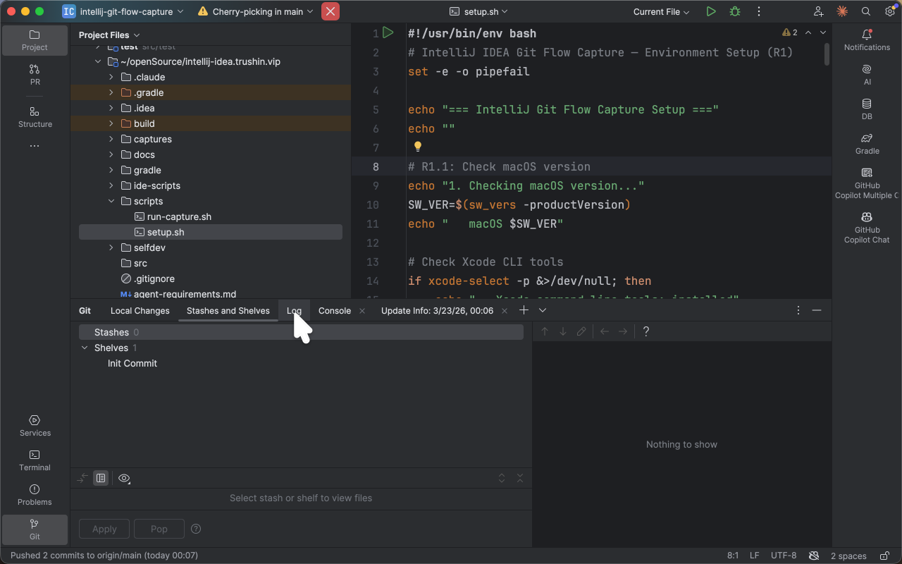

### 20260323_085416_479_before_open_commit_tool_window

### 20260323_085419_872_during_commit_tool_window

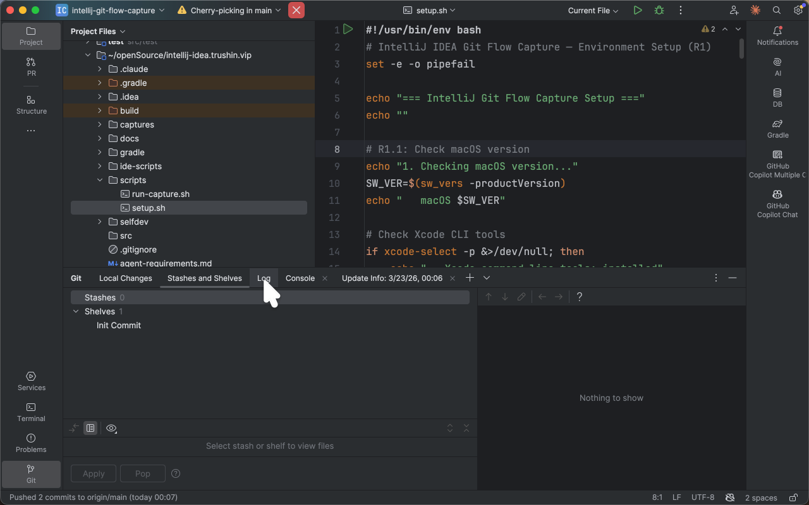

### 20260323_085421_619_after_open_commit_tool_window

### 20260323_085424_586_before_stage_and_commit

### 20260323_085717_908_during_git_log_before_hard_reset

### 20260323_085719_712_during_git_log_after_hard_reset

### 20260323_085721_985_during_commit_window_after_hard_reset

### 20260323_085723_749_after_reset_hard

### 20260323_085727_128_before_stash_changes

### 20260323_085728_960_after_stash_changes

### 20260323_085731_966_before_switch_branch_with_stash

### 20260323_085735_768_during_branches_popup_switch

### 20260323_085743_085_after_switch_branch_with_stash

### 20260323_085746_050_before_pop_stash

### 20260323_085748_354_during_unstash_dialog

### 20260323_085757_007_after_pop_stash

