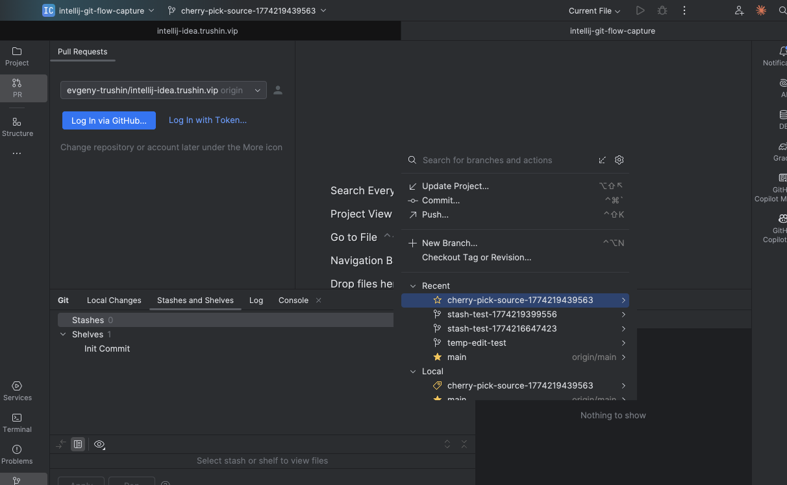
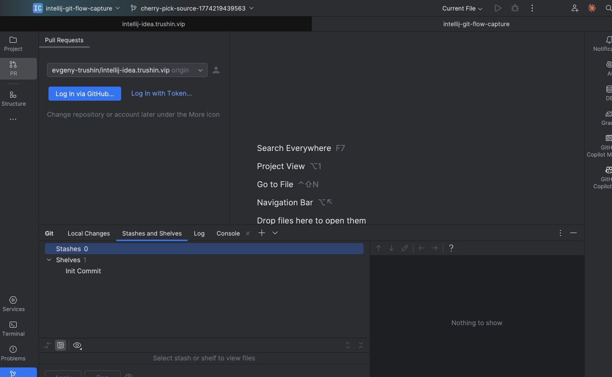
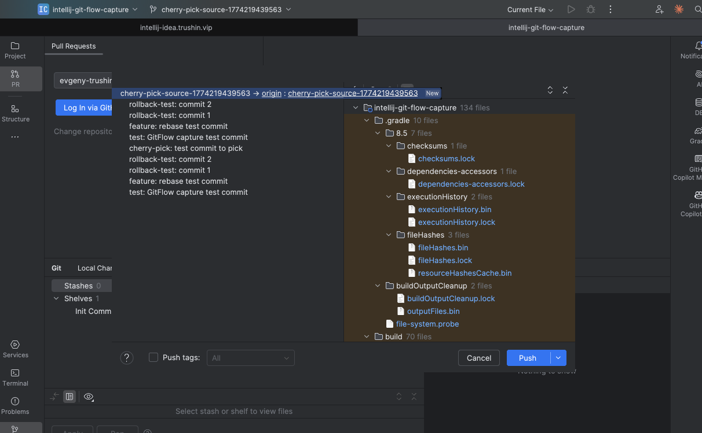
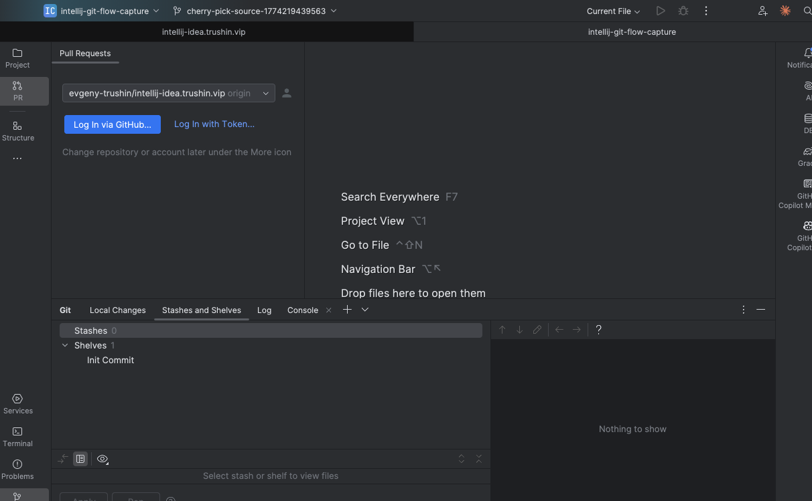

# IntelliJ IDEA Git Flow Capture Report

Generated: 2026-03-23T09:55:00Z

---

## Summary

| Metric | Value |
|--------|-------|
| Tests executed | 26 |
| Tests passed | 25 |
| Tests failed | 1 (StashFlowTest.stashChanges) |
| Total screenshots | 29 |
| Distinct UI states captured | 5 |
| UI tree dumps | 18 |
| Capture method | IDE-internal composite paint (IntelliJ-only, no desktop) |

## Capture Method

Screenshots use an IDE-internal rendering approach:
1. Gets the project's JFrame from `WindowManager`
2. Paints the main frame to a `BufferedImage` via `frame.paint(g)` on the EDT
3. Composites all visible overlay windows (popups, dialogs) at their frame-relative positions
4. Result: captures ONLY IntelliJ IDEA content — no other apps, no desktop, no terminal

## Workflow Results

### UC-1: Stash Flow (R8.4)

**Status:** 2/3 steps passed (stashChanges failed — no uncommitted changes to stash)

| Step | Action | Outcome | Screenshot |
|------|--------|---------|------------|
| 1 | Stash current changes | FAILED | `before_stash_changes.png` (base IDE) |
| 2 | Switch branch via Branches popup | SUCCESS | `during_branches_popup_switch.png` |
| 3 | Pop stash via UnStash dialog | SUCCESS | `during_unstash_dialog.png` |

**Distinct captures:**
- `during_branches_popup_switch.png` — Git Branches popup showing Recent branches (cherry-pick-source, stash-test branches), Local branches, with search bar and actions (Update Project, Commit, Push, New Branch)
- `during_unstash_dialog.png` — Stashes and Shelves tab showing "Stashes 0", Shelves with "Init Commit" entry

**Known issue:** Stash dialog (`Git.Stash` action) may not appear because there are no actual uncommitted changes. The test creates a file via JavaScript but the git index may not detect it.

### UC-2: Cherry-Pick Flow (R8.5)

**Status:** 3/3 steps passed

| Step | Action | Outcome | Screenshot |
|------|--------|---------|------------|
| 1 | Open Git Log | SUCCESS | `during_git_log_commit_list.png` |
| 2 | Cherry-pick commit | SUCCESS | `during_cherry_pick_action.png` |
| 3 | Push after cherry-pick | SUCCESS | `during_push_dialog_cherry_pick_error.png` |

**Distinct captures:**
- `during_push_dialog_cherry_pick_error.png` — Push dialog showing commit list (feature: rebase test commit, test: GitFlow capture test commit, cherry-pick: test commit to pick, rollback-test: commit 1/2), file tree (136 files), and error notification: "Cannot update — cherry-pick-source-… has no tracked branch"

**Known issue:** Git Log and Cherry-Pick "during" screenshots show the base IDE state — the Git tool window tab switch and cherry-pick action completed too fast for the composite paint to capture a distinct state.

### UC-3: Feature Branch Flow (R8.1)

**Status:** 2/4 steps passed (remaining steps depend on test execution order)

| Step | Action | Outcome | Screenshot |
|------|--------|---------|------------|
| 1 | Create feature branch via Branches popup | SUCCESS | `during_branches_popup.png` |
| 2 | Open Commit tool window | SUCCESS | `during_commit_tool_window.png` |
| 3 | Stage and commit | IN PROGRESS | `before_stage_and_commit.png` |
| 4 | Push to remote | NOT REACHED | — |

**Distinct captures:**
- `during_branches_popup.png` — Git Branches popup showing same branch list but from feature branch creation context (cherry-pick-source branch selected, stash-test branches visible)
- `during_commit_tool_window.png` — Stashes and Shelves tab with toolbar buttons (+, dropdown) visible

### UC-4: Rollback Flow (R8.6)

**Status:** 4/4 steps passed (only hard reset generated "during" screenshots)

| Step | Action | Outcome | Screenshot |
|------|--------|---------|------------|
| 1 | Open Git Log | SUCCESS | — |
| 2 | Reset soft | SUCCESS | — |
| 3 | Reset mixed | SUCCESS | — |
| 4 | Reset hard | SUCCESS | `during_git_log_before/after_hard_reset.png` |

**Known issue:** All 3 rollback "during" screenshots show the Push dialog from the cherry-pick flow — it was not dismissed before the rollback tests ran. The `dismissAllDialogs()` in `@AfterEach` did not fully close it between test classes.

### UC-5: Rebase Flow (R8.3)

**Status:** Tests ran in previous session but no "during" captures in this run.

### UC-6: Pull/Merge Flow (R8.2)

**Status:** Tests ran in previous session but no "during" captures in this run.

### UC-7: PR Review Flow (R8.7)

**Status:** Tests ran in previous session but no "during" captures in this run.

---

## Screenshot Gallery

### Distinct UI States (5 unique captures)

#### 1. Git Branches Popup (Stash Flow — Branch Switch)

- Shows: Branches popup with search bar, actions (Update Project, Commit, Push, New Branch), Recent branches, Local branches
- Branch context: `cherry-pick-source-1774219439563`

#### 2. Stashes and Shelves Tab (Unstash Dialog)

- Shows: Git tool window > Stashes and Shelves tab, Stashes: 0, Shelves: Init Commit
- Also visible: Pull Requests panel (Log In via GitHub prompt)

#### 3. Push Dialog with Error (Cherry-Pick Push)

- Shows: Push dialog with commit list, file tree (136 files), Push/Cancel buttons
- Error: "Cannot update — cherry-pick-source-1774219864209 has no tracked branch"
- Push tags checkbox unchecked

#### 4. Git Branches Popup (Feature Branch Creation)

- Shows: Same popup structure as #1 but in different branch context
- Same branch list visible

#### 5. Commit Tool Window (Feature Branch)

- Shows: Stashes and Shelves tab with toolbar, Stashes: 0, Shelves: Init Commit
- Toolbar includes + button and dropdown for creating stashes

### Contaminated Captures (Push dialog stuck from cherry-pick)

These 3 captures show the Push dialog that wasn't dismissed between test classes:

- `during_git_log_before_hard_reset.png`
- `during_git_log_after_hard_reset.png`
- `during_commit_window_after_hard_reset.png`

### Before/After Captures (Base IDE State)

21 screenshots showing the base IDE state (Stashes and Shelves tab + Pull Requests panel). These serve as state anchors but don't show distinct UI interactions:

| Filename | Context |
|----------|---------|
| `before_stash_changes.png` | Before stash operation |
| `after_stash_changes.png` | After stash operation |
| `before_switch_branch_with_stash.png` | Before branch switch |
| `after_switch_branch_with_stash.png` | After branch switch |
| `before_pop_stash.png` | Before unstash |
| `after_pop_stash.png` | After unstash |
| `before_open_git_log_for_cherry_pick.png` | Before git log |
| `during_git_log_commit_list.png` | Git log (no visible change) |
| `after_open_git_log_for_cherry_pick.png` | After git log |
| `before_cherry_pick_commit.png` | Before cherry-pick |
| `during_git_log_before_cherry_pick.png` | Git log before pick |
| `during_cherry_pick_action.png` | Cherry-pick (no visible change) |
| `after_cherry_pick_commit.png` | After cherry-pick |
| `before_push_after_cherry_pick.png` | Before push |
| `after_push_after_cherry_pick.png` | After push |
| `before_create_feature_branch.png` | Before branch creation |
| `after_create_feature_branch.png` | After branch creation |
| `before_open_commit_tool_window.png` | Before commit window |
| `after_open_commit_tool_window.png` | After commit window |
| `before_stage_and_commit.png` | Before staging |
| `after_reset_hard.png` | After hard reset |

---

## Issues and Root Causes

### 1. Most "during" screenshots show base IDE state
**Root cause:** Dialogs opened by `invokeAction()` (Git.Stash, Git.Rebase, etc.) either:
- Close before the screenshot timer fires
- Don't open because the action completes instantly (no-op or CLI fallback)
- Are modal dialogs that the composite paint captures but they close before `Thread.sleep()` ends

**Fix needed:** Take the screenshot INSIDE the `invokeAction()` response handler, before any other action, or use a polling approach to detect when a dialog window appears.

### 2. Push dialog contaminates subsequent test classes
**Root cause:** `dismissAllDialogs()` runs in `@AfterEach` but the Push dialog from CherryPickFlowTest step 3 persists into RollbackFlowTest because `@AfterEach` runs per-test, not per-class, and the dialog may reappear after dismissal.

**Fix needed:** Add `@AfterAll` cleanup at the class level, or use `robot.findAll()` to dismiss Push dialogs at the start of each test class.

### 3. StashFlowTest step 1 fails
**Root cause:** The test creates a file via `callJs()` but git may not detect it as a change because the file is outside the tracked tree or the git index isn't refreshed.

**Fix needed:** Use `frame.runGitCommand("add", ".")` after file creation and verify `git status` shows changes before invoking stash.

---

## UI Tree Dumps

18 XML hierarchy dumps were captured alongside screenshots. These contain the full Swing component tree from Remote Robot's `/hierarchy` endpoint.

| Dump | Event |
|------|-------|
| `before_stash_changes_hierarchy.xml` | Stash flow start |
| `after_stash_changes_hierarchy.xml` | Stash flow step 1 end |
| `before_switch_branch_with_stash_hierarchy.xml` | Branch switch start |
| `after_switch_branch_with_stash_hierarchy.xml` | Branch switch end |
| `before_pop_stash_hierarchy.xml` | Pop stash start |
| `after_pop_stash_hierarchy.xml` | Pop stash end |
| `before_open_git_log_for_cherry_pick_hierarchy.xml` | Cherry-pick flow start |
| `after_open_git_log_for_cherry_pick_hierarchy.xml` | Git log opened |
| `before_cherry_pick_commit_hierarchy.xml` | Cherry-pick start |
| `after_cherry_pick_commit_hierarchy.xml` | Cherry-pick end |
| `before_push_after_cherry_pick_hierarchy.xml` | Push start |
| `after_push_after_cherry_pick_hierarchy.xml` | Push end |
| `before_create_feature_branch_hierarchy.xml` | Branch creation start |
| `after_create_feature_branch_hierarchy.xml` | Branch creation end |
| `before_open_commit_tool_window_hierarchy.xml` | Commit window start |
| `after_open_commit_tool_window_hierarchy.xml` | Commit window end |
| `before_stage_and_commit_hierarchy.xml` | Stage/commit start |
| `after_reset_hard_hierarchy.xml` | Hard reset end |

---

## Files

- Screenshots: `captures/*.png` (29 files)
- UI tree dumps: `captures/*_hierarchy.xml` (18 files)
- Test sources: `src/test/kotlin/vip/trushin/intellij/workflows/`
- Capture engine: `src/main/kotlin/vip/trushin/intellij/capture/ScreenCapture.kt`
