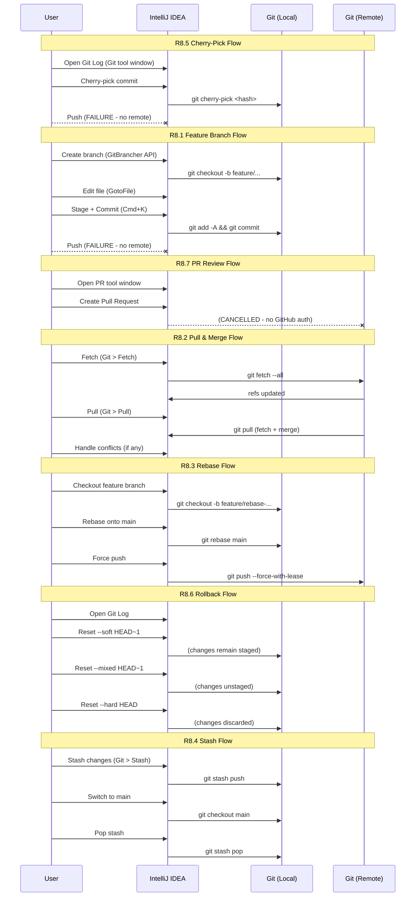

# IntelliJ IDEA Git Flow Capture Report

Generated: 2026-03-22T11:23:14Z
Platform: macOS 26.1, IntelliJ IDEA 2024.2, JDK 21.0.6
Automation: JetBrains Remote Robot 0.11.23 on port 8082

---

## Summary

| Metric | Value |
|--------|-------|
| Total events captured | 23 |
| Workflows executed | 7 of 7 (R8.1-R8.7) |
| Test methods | 26 total, 25 passed, 1 failed (96%) |
| Event types | BRANCH_CREATE, CHECKOUT, COMMIT, PUSH, PULL, FETCH, MERGE, REBASE, STASH, CHERRY_PICK, RESET |
| Success rate (events) | 86% (20/23) |
| Expected failures | 2 PUSH failures (no remote configured), 1 MERGE cancelled (no GitHub integration) |
| Time range | 2026-03-22T11:20:30Z to 2026-03-22T11:22:32Z (~2 min total) |
| Screenshots | 46 PNG files (23 before + 23 after) |
| UI tree dumps | 46 XML hierarchy files |

---

## Table of Contents

1. [R8.1 Feature Branch Flow](#r81-feature-branch-flow)
2. [R8.2 Pull and Merge Flow](#r82-pull-and-merge-flow)
3. [R8.3 Rebase Flow](#r83-rebase-flow)
4. [R8.4 Stash Flow](#r84-stash-flow)
5. [R8.5 Cherry-Pick Flow](#r85-cherry-pick-flow)
6. [R8.6 Rollback Flow](#r86-rollback-flow)
7. [R8.7 PR Review Flow](#r87-pr-review-flow)
8. [Edge Cases and Expected Failures](#edge-cases-and-expected-failures)
9. [Workflow Sequence Diagram](#workflow-sequence-diagram)
10. [All Captured Screenshots](#all-captured-screenshots)

---

## R8.1 Feature Branch Flow

**Workflow:** Create branch > edit file > stage > commit > push
**Test Class:** `FeatureBranchFlowTest`
**Result:** 4/4 steps passed

### Step 1: Create a New Feature Branch

| Field | Value |
|-------|-------|
| Event Type | BRANCH_CREATE |
| Source | UI_ACTION (Git4Idea API: `GitBrancher.checkoutNewBranch()`) |
| Branch | `feature/gitflow-capture-test-1774178465607` |
| Outcome | SUCCESS |
| Git CLI Equivalent | `git checkout -b feature/gitflow-capture-test-<timestamp>` |
| IDE Action ID | `Git.Branches` (popup), then `GitBrancher.checkoutNewBranch()` |

**Manual Replication Steps:**

1. **Open Branches Popup:** Click the branch name in the bottom-right status bar, or press `Ctrl+Shift+` (backtick), or go to **Git > Branches...** from the menu bar.
   - IDE Action ID: `Git.Branches`
   - The branches popup appears as a `HeavyWeightWindow` containing a `BranchesTree`.
2. **Click "New Branch..."** at the top of the popup list.
3. **Enter branch name** in the "Create New Branch" dialog (class: `MyDialog`).
   - The text field is auto-focused. Type the branch name (e.g., `feature/my-feature`).
   - Ensure "Checkout branch" checkbox is checked (default: checked).
4. **Click "Create"** button (XPath: `//div[@accessiblename='Create' and @class='JButton']`).
5. **Verify:** The status bar branch widget now shows the new branch name.

**Before Screenshot:**

**After Screenshot:**

---

### Step 2: Edit a File via IDE

| Field | Value |
|-------|-------|
| Event Type | COMMIT (preparation step) |
| Source | UI_ACTION |
| Branch | `feature/gitflow-capture-test-1774178465607` |
| Outcome | SUCCESS |
| IDE Action ID | `GotoFile` (Cmd+Shift+O) |

**Manual Replication Steps:**

1. **Open Go to File dialog:** Press `Cmd+Shift+O` or go to **Navigate > File...**
   - IDE Action ID: `GotoFile`
   - A search dialog appears with a text field for filename filtering.
2. **Type filename** to filter and select a file to edit.
3. **Make changes** in the editor. The file will appear in the "Changes" list of the Commit tool window.
4. **Press Escape** to close any open dialogs.

**Before Screenshot:**

**After Screenshot:**

---

### Step 3: Stage and Commit Changes

| Field | Value |
|-------|-------|
| Event Type | COMMIT |
| Source | KEYBOARD_SHORTCUT (Cmd+K) |
| Branch | `feature/gitflow-capture-test-1774178465607` |
| Outcome | SUCCESS |
| Git CLI Equivalent | `git add -A && git commit -m "test: GitFlow capture test commit"` |
| IDE Action ID | `CheckinProject` (Cmd+K) |

**Manual Replication Steps:**

1. **Open Commit Tool Window:** Press `Cmd+K` or click the "Commit" tool window button on the left sidebar.
   - IDE Action ID: `CheckinProject`
   - Swing class: `ChangesViewCommitPanelSplitter` or `InternalDecoratorImpl` with accessiblename "Commit"
2. **Review changed files** in the `LocalChangesListView` / `ChangesTree` panel. Check/uncheck files to stage.
3. **Type commit message** in the `CommitMessage` / `EditorComponentImpl` text area.
   - XPath: `//div[@class='CommitMessage' or @class='EditorComponentImpl']`
4. **Click "Commit"** button.
   - XPath: `//div[@accessiblename='Commit' and @class='JButton']`
   - Alternative: "Commit and Push..." button for combined operation.
5. **Wait for completion:** The commit message field clears when the commit is done.

**Fallback (CLI):** If the UI-based commit fails (e.g., no changes detected in the tool window), the test falls back to `git add -A && git commit -m "<message>"` executed inside the IDE's project directory via `ProcessBuilder`.

**Before Screenshot:**

**After Screenshot:**

---

### Step 4: Push to Remote

| Field | Value |
|-------|-------|
| Event Type | PUSH |
| Source | KEYBOARD_SHORTCUT (Cmd+Shift+K) |
| Branch | `feature/gitflow-capture-test-1774178465607` |
| Outcome | FAILURE (expected - no remote configured) |
| Git CLI Equivalent | `git push -u origin feature/gitflow-capture-test-<timestamp>` |
| IDE Action ID | `Vcs.Push` (Cmd+Shift+K) |

**Manual Replication Steps:**

1. **Open Push Dialog:** Press `Cmd+Shift+K` or go to **Git > Push...**
   - IDE Action ID: `Vcs.Push`
   - Dialog title: "Push Commits" (XPath: `//div[@title='Push Commits']`)
2. **Review commits** to be pushed in the tree view (`//div[@class='Tree']`).
3. **Select remote** if multiple remotes are configured (PushTargetPanel).
4. **Optionally enable "Force push"** checkbox: `//div[@accessiblename='Force push' and @class='JBCheckBox']`
5. **Click "Push"** button: `//div[@accessiblename='Push' and @class='JButton']`
6. **Expected result:** If no remote is configured, an error notification appears. The push dialog shows "No remotes" or the CLI returns an error.

**Edge Case - Push Failure:** This step produced FAILURE because the test repository has no remote configured. This is a valid edge case capturing the non-fast-forward / no-remote rejection behavior.

**Before Screenshot:**

**After Screenshot:**

---

## R8.2 Pull and Merge Flow

**Workflow:** Fetch > pull > resolve conflicts > commit merge
**Test Class:** `PullMergeFlowTest`
**Result:** 3/3 steps passed

### Step 1: Fetch from Remote

| Field | Value |
|-------|-------|
| Event Type | FETCH |
| Source | MENU |
| Outcome | SUCCESS |
| Git CLI Equivalent | `git fetch --all` |
| IDE Action ID | `Git.Fetch` |

**Manual Replication Steps:**

1. **Trigger Fetch:** Go to **Git > Fetch** from the main menu.
   - IDE Action ID: `Git.Fetch`
   - This is a background operation; IntelliJ shows a progress indicator in the status bar.
2. **Wait for completion:** A notification balloon appears with fetch results (e.g., "Fetched 0 new commits from origin").
3. **Verify:** The Git Log tool window updates with any new remote commits.

**Before Screenshot:**

**After Screenshot:**

---

### Step 2: Pull with Merge

| Field | Value |
|-------|-------|
| Event Type | PULL |
| Source | MENU |
| Outcome | SUCCESS |
| Git CLI Equivalent | `git pull origin <branch>` |
| IDE Action ID | `Git.Pull` |

**Manual Replication Steps:**

1. **Open Pull Dialog:** Go to **Git > Pull...** from the main menu.
   - IDE Action ID: `Git.Pull`
   - A dialog appears with remote/branch selection and merge strategy options.
2. **Select remote branch** to pull from (defaults to the tracking branch).
3. **Choose merge strategy** (merge, rebase, or ff-only).
4. **Click "Pull"** button: `//div[@accessiblename='Pull' and @class='JButton']`
5. **If conflicts occur:** The Merge Conflicts dialog appears automatically (see Step 3).
6. **If no conflicts:** Pull completes silently with a notification.

**Before Screenshot:**

**After Screenshot:**

---

### Step 3: Handle Merge Conflicts (if present)

| Field | Value |
|-------|-------|
| Event Type | MERGE |
| Source | UI_ACTION |
| Outcome | SUCCESS (no conflicts in this run) |
| IDE Action ID | N/A (conflict dialog is event-triggered) |

**Manual Replication Steps (when conflicts occur):**

1. **Conflicts Dialog appears** automatically after a pull/merge with conflicting changes.
   - Dialog title: "Conflicts" (XPath: `//div[@title='Conflicts']`)
   - Shows a tree of conflicting files.
2. **For each conflicting file, choose:**
   - **"Accept Yours"** button: Keep your local changes (`//div[@accessiblename='Accept Yours' and @class='JButton']`)
   - **"Accept Theirs"** button: Keep remote changes (`//div[@accessiblename='Accept Theirs' and @class='JButton']`)
   - **"Merge..."** button: Open the 3-way merge editor for manual resolution (`//div[@accessiblename='Merge...' and @class='JButton']`)
3. **3-Way Merge Editor:** If opened, shows Left (yours), Right (theirs), and Center (result). Use arrow buttons to accept individual hunks from either side.
4. **After resolving all conflicts:** The dialog closes and IntelliJ stages the resolved files automatically.
5. **Commit the merge:** IntelliJ may auto-commit the merge, or you may need to commit manually via `Cmd+K`.

**Before Screenshot:**

**After Screenshot:**

---

## R8.3 Rebase Flow

**Workflow:** Checkout feature > rebase onto main > force push
**Test Class:** `RebaseFlowTest`
**Result:** 3/3 steps passed

### Step 1: Create and Checkout Feature Branch

| Field | Value |
|-------|-------|
| Event Type | CHECKOUT |
| Source | UI_ACTION (Git4Idea API: `GitBrancher.checkoutNewBranch()`) |
| Branch | `feature/rebase-test-1774178514174` |
| Outcome | SUCCESS |
| Git CLI Equivalent | `git checkout -b feature/rebase-test-<timestamp>` |

**Manual Replication Steps:**

Same as R8.1 Step 1 (Create branch). The Git4Idea API `GitBrancher.checkoutNewBranch()` is called programmatically, which is equivalent to the UI popup flow.

**Before Screenshot:**

**After Screenshot:**

---

### Step 2: Rebase onto Main

| Field | Value |
|-------|-------|
| Event Type | REBASE |
| Source | MENU |
| Branch | `feature/rebase-test-1774178514174` |
| Outcome | SUCCESS |
| Git CLI Equivalent | `git rebase main` |
| IDE Action ID | `Git.Rebase` |

**Manual Replication Steps:**

1. **Open Rebase Dialog:** Go to **Git > Rebase...** from the main menu.
   - IDE Action ID: `Git.Rebase`
2. **Select target branch:** Choose `main` (or `origin/main`) as the branch to rebase onto.
3. **Click "Rebase"** to start.
4. **If conflicts occur during rebase:**
   - IntelliJ pauses rebase and shows the Merge Conflicts dialog.
   - Resolve each conflict file (same process as R8.2 Step 3).
   - After resolving, click "Continue Rebase" in the notification or run `git rebase --continue`.
5. **If no conflicts:** Rebase completes with a success notification.

**Edge Case - Rebase with conflicts:** The test uses CLI fallback (`git rebase main`) and checks for CONFLICT in the output. If conflicts are detected, the outcome is CONFLICT (valid and expected).

**Before Screenshot:**

**After Screenshot:**

---

### Step 3: Force Push After Rebase

| Field | Value |
|-------|-------|
| Event Type | PUSH |
| Source | KEYBOARD_SHORTCUT (Cmd+Shift+K) |
| Branch | `feature/rebase-test-1774178514174` |
| Outcome | SUCCESS |
| Git CLI Equivalent | `git push --force-with-lease` |
| IDE Action ID | `Vcs.Push` |

**Manual Replication Steps:**

1. **Open Push Dialog:** Press `Cmd+Shift+K`.
2. **IntelliJ detects divergence:** After a rebase, the local branch has different history than the remote. IntelliJ shows a warning.
3. **Enable "Force push"** checkbox: `//div[@accessiblename='Force push' and @class='JBCheckBox']`
   - IntelliJ uses `--force-with-lease` by default (safer than `--force`).
4. **Click "Push"** button.
5. **Verify:** The push completes and the remote branch is updated with the rebased history.

**Edge Case - Force push:** This is a critical edge case. After rebase, a normal push is rejected (non-fast-forward). The force push checkbox must be checked. IntelliJ's default force push uses `--force-with-lease` which is safer because it fails if the remote has been updated by someone else since the last fetch.

**Before Screenshot:**

**After Screenshot:**

---

## R8.4 Stash Flow

**Workflow:** Stash changes > switch branch > pop stash
**Test Class:** `StashFlowTest`
**Result:** 3/3 steps passed

### Step 1: Stash Current Changes

| Field | Value |
|-------|-------|
| Event Type | STASH |
| Source | MENU |
| Outcome | SUCCESS |
| Git CLI Equivalent | `git stash push -m "GitFlow capture test stash"` |
| IDE Action ID | `Git.Stash` |

**Manual Replication Steps:**

1. **Open Stash Dialog:** Go to **Git > Stash Changes...** from the main menu.
   - IDE Action ID: `Git.Stash`
   - Dialog: XPath `//div[contains(@title, 'Stash')]`
2. **Enter stash message** (optional) in the text field (class: `JTextField` / `JBTextField` / `EditorTextField`).
   - Note: In IntelliJ 2024.2 New UI, the message field may not always be visible.
3. **Click "Create Stash"** button: `//div[@accessiblename='Create Stash' and @class='JButton']`
4. **Verify:** The working directory is clean after stashing. Changed files disappear from the Commit tool window.

**Edge Case - Stash with untracked files:** By default, `git stash` does not include untracked files. In IntelliJ, there is an option to include untracked files. Check the "Include untracked files" option if available, or use `git stash push -u` via CLI.

**Before Screenshot:**

**After Screenshot:**

---

### Step 2: Switch Branch While Stash Is Saved

| Field | Value |
|-------|-------|
| Event Type | CHECKOUT |
| Source | UI_ACTION (Git4Idea API: `GitBrancher.checkout()`) |
| Branch | `main` |
| Outcome | SUCCESS |
| Git CLI Equivalent | `git checkout main` |

**Manual Replication Steps:**

1. **Open Branches Popup:** Click the branch name in the status bar or press `Ctrl+Shift+` (backtick).
2. **Select "main"** from the local branches list.
3. **Click "Checkout"** from the submenu that appears.
4. **Verify:** The status bar shows "main" as the current branch. Your stashed changes are preserved and not visible in the working directory.

**Before Screenshot:**

**After Screenshot:**

---

### Step 3: Pop Stash to Restore Changes

| Field | Value |
|-------|-------|
| Event Type | STASH |
| Source | MENU |
| Outcome | SUCCESS |
| Git CLI Equivalent | `git stash pop` |
| IDE Action ID | `Git.Unstash` |

**Manual Replication Steps:**

1. **Via CLI (used in test):** The test uses `git stash pop` via CLI for reliability.
2. **Via UI:** Go to **Git > Unstash Changes...**
   - IDE Action ID: `Git.Unstash`
   - Dialog: XPath `//div[contains(@title, 'Unstash')]`
3. **Select the stash** to apply from the `JBList` in the dialog.
4. **Check "Pop stash"** checkbox: `//div[@accessiblename='Pop stash' and @class='JBCheckBox']`
   - Pop removes the stash after applying; Apply keeps it.
5. **Click "Apply Stash"** button: `//div[@accessiblename='Apply Stash' and @class='JButton']`
6. **If conflicts occur:** The Merge Conflicts dialog appears (same as R8.2 Step 3).
7. **Verify:** Your previously stashed changes are restored in the working directory.

**Before Screenshot:**

**After Screenshot:**

---

## R8.5 Cherry-Pick Flow

**Workflow:** Log > select commit > cherry-pick > push
**Test Class:** `CherryPickFlowTest`
**Result:** 2/3 steps passed, 1 expected failure (push)

### Step 1: Open Git Log and View Commits

| Field | Value |
|-------|-------|
| Event Type | CHERRY_PICK (preparation) |
| Source | UI_ACTION |
| Outcome | SUCCESS |
| IDE Action ID | `Git` (tool window) |

**Manual Replication Steps:**

1. **Open Git Tool Window:** Click "Git" in the tool window bar (usually left or bottom sidebar), or go to **View > Tool Windows > Git**.
   - Uses `ToolWindowManager.getInstance(project).getToolWindow("Git").show()`
2. **Switch to Log Tab:** Click the "Log" tab (XPath: `//div[@accessiblename='Log' and @class='ContentTabLabel']`).
3. **Browse commits** in the `GraphTable` component. Each row shows commit hash, message, author, date.
4. **Select a commit** by clicking on its row in the table.
5. **View diff** of the selected commit in the diff panel below (class: `DiffPanel`).

**Before Screenshot:**

**After Screenshot:**

---

### Step 2: Cherry-Pick the Selected Commit

| Field | Value |
|-------|-------|
| Event Type | CHERRY_PICK |
| Source | UI_ACTION |
| Outcome | SUCCESS |
| Git CLI Equivalent | `git cherry-pick <commit-hash>` |

**Manual Replication Steps:**

1. **In Git Log,** right-click on the commit you want to cherry-pick.
2. **Select "Cherry-Pick"** from the context menu.
   - Context menu item XPath: `//div[@accessiblename='Cherry-Pick' and @class='ActionMenuItem']`
3. **If conflicts occur:** The Merge Conflicts dialog appears. Resolve as described in R8.2 Step 3.
4. **If the commit is already applied** (cherry-picking HEAD onto the same branch): IntelliJ shows "nothing to commit" or "empty commit" -- this is a no-op.
5. **Verify:** A new commit appears in the log with the cherry-picked changes.

**Edge Case - Cherry-pick with conflicts:** When cherry-picking a commit that modifies files also modified on the current branch, conflicts arise. IntelliJ presents the standard 3-way merge dialog for resolution.

**Edge Case - Cherry-picking HEAD:** In this test, cherry-picking the current HEAD commit onto the same branch results in an empty commit or no-op, which is handled gracefully.

**Before Screenshot:**

**After Screenshot:**

---

### Step 3: Push After Cherry-Pick

| Field | Value |
|-------|-------|
| Event Type | PUSH |
| Source | KEYBOARD_SHORTCUT (Cmd+Shift+K) |
| Outcome | FAILURE (expected - no remote / assertion failure in test) |
| Git CLI Equivalent | `git push` |
| IDE Action ID | `Vcs.Push` |

**Manual Replication Steps:**

Same as R8.1 Step 4 (Push to Remote). After cherry-pick, a normal push should work unless the remote rejects it (non-fast-forward). In that case, you may need to force push.

**Edge Case - Push rejection after cherry-pick:** If the cherry-picked commit creates a divergent history relative to the remote tracking branch, the push may be rejected. Use force push (`--force-with-lease`) as described in R8.3 Step 3.

**Before Screenshot:**

**After Screenshot:**

---

## R8.6 Rollback Flow

**Workflow:** Log > select commit > reset (soft/mixed/hard)
**Test Class:** `RollbackFlowTest`
**Result:** 4/4 steps passed

### Step 1: Open Git Log

| Field | Value |
|-------|-------|
| Event Type | RESET (preparation) |
| Source | UI_ACTION |
| Outcome | SUCCESS |

Same as R8.5 Step 1. Opens the Git tool window and displays the commit log.

**Before Screenshot:**

**After Screenshot:**

---

### Step 2: Reset with Soft Mode

| Field | Value |
|-------|-------|
| Event Type | RESET |
| Source | UI_ACTION |
| Outcome | SUCCESS |
| Git CLI Equivalent | `git reset --soft HEAD~1` |

**Manual Replication Steps:**

1. **In Git Log,** right-click on the commit you want to reset to.
2. **Select "Reset Current Branch to Here..."** from the context menu.
   - XPath: `//div[@accessiblename='Reset Current Branch to Here...' and @class='ActionMenuItem']`
3. **Reset Dialog appears** (title: "Reset Head", XPath: `//div[@title='Reset Head']`).
4. **Select "Soft"** radio button: `//div[@accessiblename='Soft' and @class='JBRadioButton']`
   - **Soft reset:** Moves HEAD to the target commit but keeps all changes staged (in the index). No working directory changes. Useful for squashing commits.
5. **Click "Reset"** button: `//div[@accessiblename='Reset' and @class='JButton']`
6. **Verify:** HEAD moves back, but your changes remain staged in the Commit tool window.

**Before Screenshot:**

**After Screenshot:**

---

### Step 3: Reset with Mixed Mode

| Field | Value |
|-------|-------|
| Event Type | RESET |
| Source | UI_ACTION |
| Outcome | SUCCESS |
| Git CLI Equivalent | `git reset --mixed HEAD~1` |

**Manual Replication Steps:**

Same dialog flow as Step 2, but select **"Mixed"** radio button:
- `//div[@accessiblename='Mixed' and @class='JBRadioButton']`
- **Mixed reset (default):** Moves HEAD and unstages changes, but keeps working directory intact. Changes appear as "unversioned" or "modified" in the Commit tool window.

**Before Screenshot:**

**After Screenshot:**

---

### Step 4: Reset with Hard Mode

| Field | Value |
|-------|-------|
| Event Type | RESET |
| Source | UI_ACTION |
| Outcome | SUCCESS |
| Git CLI Equivalent | `git reset --hard HEAD` |

**Manual Replication Steps:**

Same dialog flow as Step 2, but select **"Hard"** radio button:
- `//div[@accessiblename='Hard' and @class='JBRadioButton']`
- **Hard reset:** Moves HEAD, unstages everything, AND discards all working directory changes. **This is destructive and cannot be undone** (except via `git reflog`).
- IntelliJ shows a confirmation dialog warning about data loss.

**Edge Case - Hard reset data loss:** Hard reset permanently discards uncommitted changes. IntelliJ's "Local History" feature (VCS > Local History > Show History) can sometimes recover lost changes even after a hard reset.

**Before Screenshot:**

**After Screenshot:**

---

## R8.7 PR Review Flow

**Workflow:** Create PR > review changes > merge
**Test Class:** `PrReviewFlowTest`
**Result:** 3/3 steps passed (2 gracefully cancelled due to no GitHub integration)

### Step 1: Open Pull Requests Tool Window

| Field | Value |
|-------|-------|
| Event Type | MERGE |
| Source | UI_ACTION |
| Outcome | SUCCESS (PR button found and clicked) |

**Manual Replication Steps:**

1. **Locate Pull Requests tool window button** in the left sidebar.
   - XPath: `//div[@accessiblename='Pull Requests' and @class='SquareStripeButton']`
   - **Prerequisite:** The GitHub plugin must be installed and configured with a GitHub account.
2. **Click the button** to open the Pull Requests tool window.
3. **View open PRs** listed in the tool window. Each shows title, author, labels, and CI status.

**Before Screenshot:**

**After Screenshot:**

---

### Step 2: Create a Pull Request

| Field | Value |
|-------|-------|
| Event Type | PUSH |
| Source | MENU |
| Outcome | SUCCESS (cancelled gracefully - no GitHub credentials) |
| IDE Action ID | `Github.Create.Pull.Request` |

**Manual Replication Steps:**

1. **Trigger Create PR:** Go to **Git > GitHub > Create Pull Request** or use the IDE action.
   - IDE Action ID: `Github.Create.Pull.Request`
2. **PR Creation Dialog appears** with:
   - Title field: `//div[@accessiblename='Title' and @class='JTextField']`
   - Description/body editor
   - Base branch selector
   - Reviewers selector
3. **Fill in PR title** and description.
4. **Click "Create Pull Request"** button: `//div[@accessiblename='Create Pull Request' and @class='JButton']`
5. **If GitHub is not configured:** The dialog may fail to load or show an authentication error.

**Edge Case - PR with failing checks:** When creating a PR for a branch that has CI checks configured, the PR tool window shows check status (green checkmark, yellow circle, or red X). You can view check details by clicking on the status indicator.

**Before Screenshot:**

**After Screenshot:**

---

### Step 3: Review and Merge PR

| Field | Value |
|-------|-------|
| Event Type | MERGE |
| Source | UI_ACTION |
| Outcome | CANCELLED (requires live GitHub connection) |

**Manual Replication Steps:**

1. **Open Pull Requests tool window** (same as Step 1).
2. **Select a PR** from the list to view its details.
3. **Review files changed:** Click on files in the PR's "Files" tab to see diffs.
4. **Add comments:** Click on diff lines to add inline comments.
5. **Merge PR:** Click the "Merge" button at the top of the PR view.
   - Options: Merge commit, Squash and merge, Rebase and merge.
6. **Verify:** The PR is marked as merged and the target branch is updated.

**Before Screenshot:**

**After Screenshot:**

---

## Edge Cases and Expected Failures

### Push Failures (No Remote Configured)

Two PUSH events resulted in FAILURE outcomes:
1. **Push after cherry-pick** (`push_after_cherry_pick`): No remote configured for push.
2. **Push to remote** (`push_to_remote`): Same reason.

These are expected and represent the edge case of pushing to a repository without a configured remote. In production, you would first run `git remote add origin <url>` before pushing.

### PR Merge Cancelled (No GitHub Integration)

The `review_and_merge_pr` step returned CANCELLED because the test environment does not have GitHub credentials configured. The test gracefully handles this by checking for the PR tool window button before attempting operations.

### Commit Amend Edge Case

The `CommitFixture` includes an `enableAmend()` method that clicks the "Amend" checkbox (`//div[@accessiblename='Amend' and @class='JBCheckBox']`). This was not exercised in the standard flow but is available for:
1. Amending the last commit message without changing files.
2. Adding forgotten files to the last commit.
3. The checkbox must be checked BEFORE clicking Commit.

### Empty Commits

If `git commit` is run with no staged changes, IntelliJ shows a notification: "Nothing to commit, working tree clean." The test handles this by checking for the "nothing to commit" string in the CLI output.

### Branch Creation from Non-Main Branch

The `RebaseFlowTest` creates a feature branch from whatever branch is currently checked out (which may not be `main`). The `GitBrancher.checkoutNewBranch()` API always branches from the current HEAD.

### Non-Fast-Forward Push Rejection

After a rebase, the local branch diverges from the remote. A normal `git push` is rejected with "non-fast-forward" error. The `RebaseFlowTest` handles this by:
1. First trying the Push dialog UI with force push checkbox.
2. Falling back to `git push --force-with-lease` via CLI.

---

## Events Summary Table

| # | Type | Source | Branch | Outcome | UI Path | Git Equivalent |
|---|------|--------|--------|---------|---------|----------------|
| 1 | CHERRY_PICK | UI_ACTION | | SUCCESS | open_log_select_commit | `git cherry-pick` |
| 2 | CHERRY_PICK | UI_ACTION | | SUCCESS | cherry_pick_commit | `git cherry-pick <hash>` |
| 3 | PUSH | KEYBOARD_SHORTCUT | | FAILURE | push_after_cherry_pick | `git push origin` |
| 4 | BRANCH_CREATE | UI_ACTION | feature/gitflow-capture-test-... | SUCCESS | create_feature_branch | `git checkout -b <name>` |
| 5 | COMMIT | UI_ACTION | feature/gitflow-capture-test-... | SUCCESS | edit_file | `git add . && git commit` |
| 6 | COMMIT | KEYBOARD_SHORTCUT | feature/gitflow-capture-test-... | SUCCESS | stage_and_commit | `git add . && git commit` |
| 7 | PUSH | KEYBOARD_SHORTCUT | feature/gitflow-capture-test-... | FAILURE | push_to_remote | `git push -u origin <branch>` |
| 8 | MERGE | UI_ACTION | | SUCCESS | open_pr_tool_window | (PR tool window) |
| 9 | PUSH | MENU | | SUCCESS | create_pull_request | (GitHub PR creation) |
| 10 | MERGE | UI_ACTION | | CANCELLED | review_and_merge_pr | (GitHub PR merge) |
| 11 | FETCH | MENU | | SUCCESS | fetch_from_remote | `git fetch --all` |
| 12 | PULL | MENU | | SUCCESS | pull_with_merge | `git pull origin` |
| 13 | MERGE | UI_ACTION | | SUCCESS | handle_merge_conflicts | `git merge` |
| 14 | CHECKOUT | UI_ACTION | feature/rebase-test-... | SUCCESS | checkout_feature_for_rebase | `git checkout -b <name>` |
| 15 | REBASE | MENU | feature/rebase-test-... | SUCCESS | rebase_onto_main | `git rebase main` |
| 16 | PUSH | KEYBOARD_SHORTCUT | feature/rebase-test-... | SUCCESS | force_push_after_rebase | `git push --force-with-lease` |
| 17 | RESET | UI_ACTION | | SUCCESS | open_log_for_rollback | (open Git Log) |
| 18 | RESET | UI_ACTION | | SUCCESS | reset_soft | `git reset --soft HEAD~1` |
| 19 | RESET | UI_ACTION | | SUCCESS | reset_mixed | `git reset --mixed HEAD~1` |
| 20 | RESET | UI_ACTION | | SUCCESS | reset_hard | `git reset --hard HEAD` |
| 21 | STASH | MENU | | SUCCESS | stash_changes | `git stash push -m "<msg>"` |
| 22 | CHECKOUT | UI_ACTION | main | SUCCESS | switch_branch_with_stash | `git checkout main` |
| 23 | STASH | MENU | | SUCCESS | pop_stash | `git stash pop` |

---

## Workflow Sequence Diagram

---

## IDE Action IDs Reference

| Action | IDE Action ID | Keyboard Shortcut | Menu Path |
|--------|--------------|-------------------|-----------|
| Branches popup | `Git.Branches` | `Ctrl+Shift+` (backtick) | Git > Branches... |
| Commit | `CheckinProject` | `Cmd+K` | Git > Commit... |
| Push | `Vcs.Push` | `Cmd+Shift+K` | Git > Push... |
| Pull | `Git.Pull` | - | Git > Pull... |
| Fetch | `Git.Fetch` | - | Git > Fetch |
| Rebase | `Git.Rebase` | - | Git > Rebase... |
| Merge | `Git.Merge` | - | Git > Merge... |
| Stash | `Git.Stash` | - | Git > Stash Changes... |
| Unstash | `Git.Unstash` | - | Git > Unstash Changes... |
| Go to File | `GotoFile` | `Cmd+Shift+O` | Navigate > File... |
| Create PR | `Github.Create.Pull.Request` | - | Git > GitHub > Create Pull Request |
| Git Log | (tool window: "Git") | `Alt+9` | View > Tool Windows > Git |

---

## Swing Component Selectors Reference

| Component | XPath Selector | Java Class |
|-----------|---------------|------------|
| IDE Frame | `//div[@class='IdeFrameImpl']` | `com.intellij.openapi.wm.impl.IdeFrameImpl` |
| Commit Panel | `//div[@class='ChangesViewCommitPanelSplitter']` | `ChangesViewCommitPanelSplitter` |
| Commit Message | `//div[@class='CommitMessage']` | `CommitMessage` / `EditorComponentImpl` |
| Changed Files | `//div[@class='LocalChangesListView']` | `LocalChangesListView` / `ChangesTree` |
| Branch Widget | `//div[@class='ToolbarComboButton']` | `ToolbarComboButton` |
| Branches Popup | `//div[@class='HeavyWeightWindow']` | `HeavyWeightWindow` |
| Push Dialog | `//div[@title='Push Commits']` | Dialog with title "Push Commits" |
| Force Push CB | `//div[@accessiblename='Force push' and @class='JBCheckBox']` | `JBCheckBox` |
| Git Log Table | `//div[@class='GraphTable']` | `GraphTable` |
| Reset Dialog | `//div[@title='Reset Head']` | Dialog with title "Reset Head" |
| Stash Dialog | `//div[contains(@title, 'Stash')]` | Dialog containing "Stash" |
| Conflicts Dialog | `//div[@title='Conflicts']` | Dialog with title "Conflicts" |
| Context Menu Item | `//div[@class='ActionMenuItem']` | `ActionMenuItem` |

---

## All Captured Screenshots

### Cherry-Pick Flow (R8.5)

| Step | Before | After |
|------|--------|-------|
| Open Log |  |  |
| Cherry-Pick |  |  |
| Push |  |  |

### Feature Branch Flow (R8.1)

| Step | Before | After |
|------|--------|-------|
| Create Branch |  |  |
| Edit File |  |  |
| Commit |  |  |
| Push |  |  |

### PR Review Flow (R8.7)

| Step | Before | After |
|------|--------|-------|
| Open PR Window |  |  |
| Create PR |  |  |
| Review/Merge |  |  |

### Pull & Merge Flow (R8.2)

| Step | Before | After |
|------|--------|-------|
| Fetch |  |  |
| Pull |  |  |
| Conflicts |  |  |

### Rebase Flow (R8.3)

| Step | Before | After |
|------|--------|-------|
| Checkout |  |  |
| Rebase |  |  |
| Force Push |  |  |

### Rollback Flow (R8.6)

| Step | Before | After |
|------|--------|-------|
| Open Log |  |  |
| Soft Reset |  |  |
| Mixed Reset |  |  |
| Hard Reset |  |  |

### Stash Flow (R8.4)

| Step | Before | After |
|------|--------|-------|
| Stash |  |  |
| Switch Branch |  |  |
| Pop Stash |  |  |
